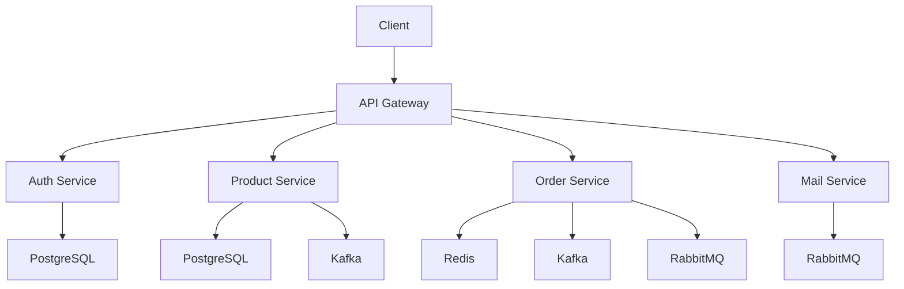

# 🚀 Learn Go Microservices Project

Welcome to my journey of building a scalable microservices architecture using Golang! This project will implement core microservices patterns with modern technologies.

[](https://golang.org/)
[](https://www.docker.com/)
[](https://opensource.org/licenses/MIT)

## 📋 Project Overview

### What We're Building

A simple e-commerce platform demonstrating microservices fundamentals:

-   **Core Services**
    -   🛂 API Gateway
    -   👥 Auth Service
    -   📦 Product Service
    -   🛒 Order Service
    -   📊 Analytics Service

### Key Architecture Components



### Installation

```bash
# Clone repository
git clone https://github.com/JordanMarcelino/learn-go-microservices.git
cd learn-go-microservices

# Set up environment (go to each services)
cp .env.example .env

# Start with Docker Compose
docker-compose up -d --build
```
