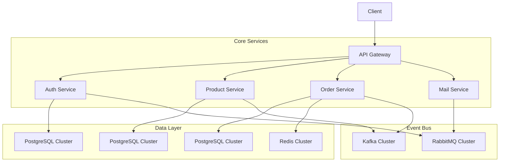
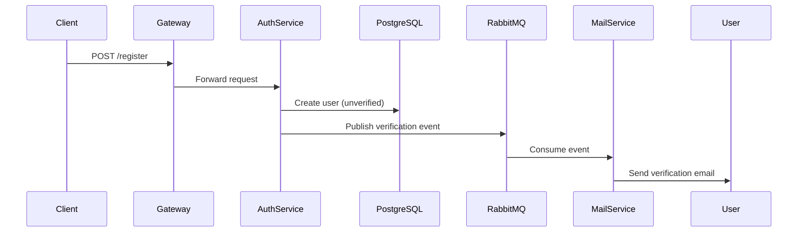
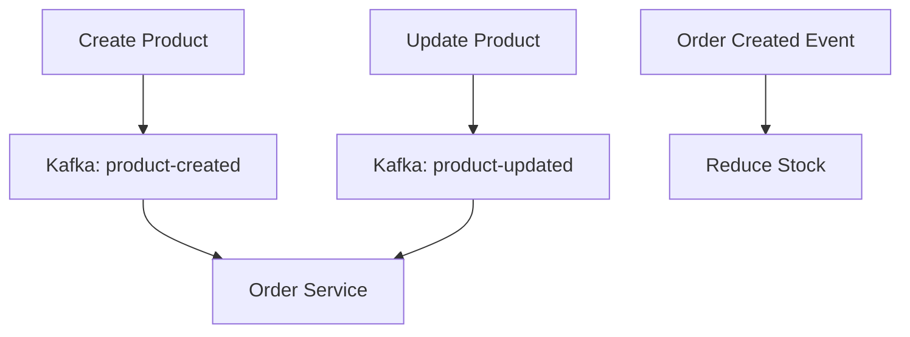
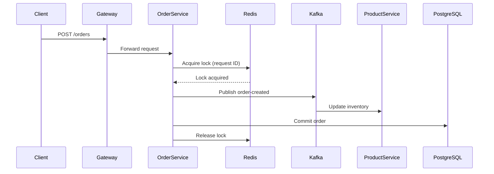
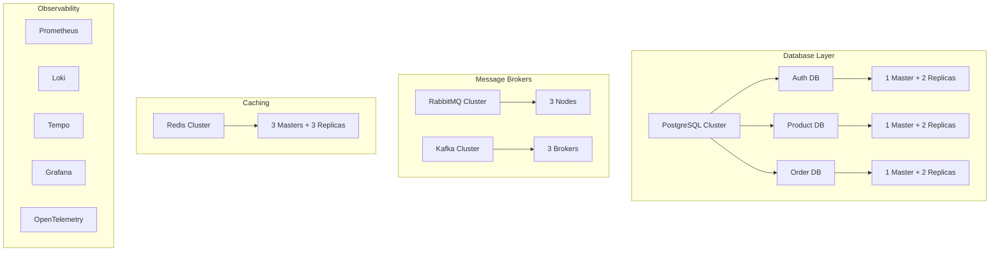
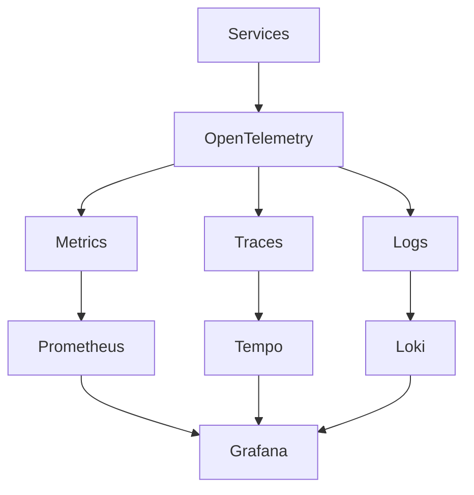
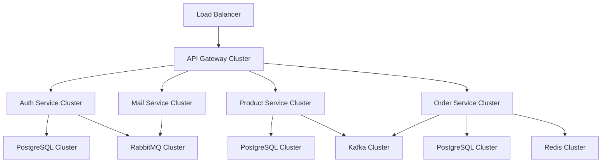

# 🚀 Go Microservices E-Commerce Platform

Welcome to my journey of building a scalable microservices architecture using Golang! This project will implement core microservices patterns with modern technologies.

## 🌟 Key Features

-   **Event-Driven Architecture** with Kafka & RabbitMQ
-   **Database Sharding** with PostgreSQL Cluster
-   **Observability** with OpenTelemetry & Grafana Stack
-   **Production-Grade** Infrastructure Setup

## 🏗 Architecture Overview

## 🛠 Service Breakdown

### 1. 🔐 Auth Service

**Responsibilities**: User identity management and authentication

**Key Features**:

-   JWT-based authentication
-   Email verification with 10-minute expiry
-   Anti-spam protection (1-minute cooldown)
-   CQRS pattern with master-slave replication
-   Horizontal scaling with pgpool-II

---

### 2. 📦 Product Service

**Responsibilities**: Product lifecycle management

**Key Features**:

-   Real-time inventory synchronization
-   Event sourcing for product changes
-   CQRS pattern with master-slave replication

---

### 3. 🛒 Order Service

**Responsibilities**: Order processing and fulfillment

**Key Features**:

-   Redis distributed locking for idempotency
-   Event-driven order processing
-   Circuit breaker pattern for inventory checks

---

### 4. 📧 Mail Service

**Responsibilities**: Asynchronous email processing

**Key Features**:

-   RabbitMQ consumer
-   Template-based email rendering
-   Send retry mechanism with exponential backoff
-   MailHog integration for development

---

### 5. 🌉 API Gateway

**Responsibilities**: Unified API entrypoint

**Key Features**:

-   JWT validation middleware
-   Rate limiting per service
-   Request/Response transformation
-   Prometheus metrics collection

## 🏭 Infrastructure Architecture

## 🔍 Observability Stack

## 📈 Deployment Architecture

**Monitoring Features**:

-   Real-time service metrics
-   Distributed tracing across services
-   Centralized logging with labels
-   Performance dashboards per service

## 🛠️ Technology Stack

**Languages & Frameworks**

-   Go 1.23+
-   Gin Web Framework

**Databases**

-   PostgreSQL 16 with pgpool-II
-   Bitnami Redis Latest Cluster

**Message Brokers**

-   Bitnami Kafka Latest Cluster
-   RabbitMQ 4.0 Cluster

**Infrastructure**

-   Docker Swarm
-   HAProxy for load balancing
-   MailHog SMTP server

**Observability**

-   Prometheus
-   Grafana
-   Loki
-   Tempo
-   OpenTelemetry
